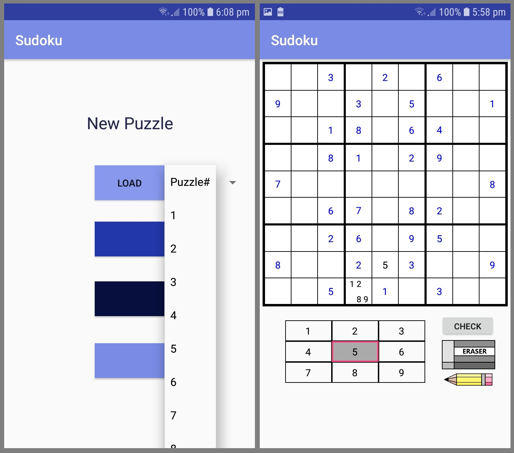

# Sudoku
A simple, incomplete (but functional) sudoku app for android devices which I created as an effort to learn java/app development. Currently, the user has the choice of 50 easy puzzles obtained from a list from a Project Euler problem: https://projecteuler.net/problem=96. 

Designed and tested on devices with dimensions: 720 x 1280 and 480 x 800 pixels. Requires mininmum API version: 17 (Jelly Bean).

Main Activity and Game Activity are the two functional Activities, while SudokuCell and CustomRadioButton are custom views created for use in the game. Other java code was used for testing different ideas that are currently unused eg. a single view for the whole board or asynchronously loading views for the board to decrease the load time. 

### Missing/TODO:
- Timer
- Pause function
- Save/Load functions
- Different difficulty puzzles or randomised puzzles

Screenshots of Main Activity and Game Activity:

